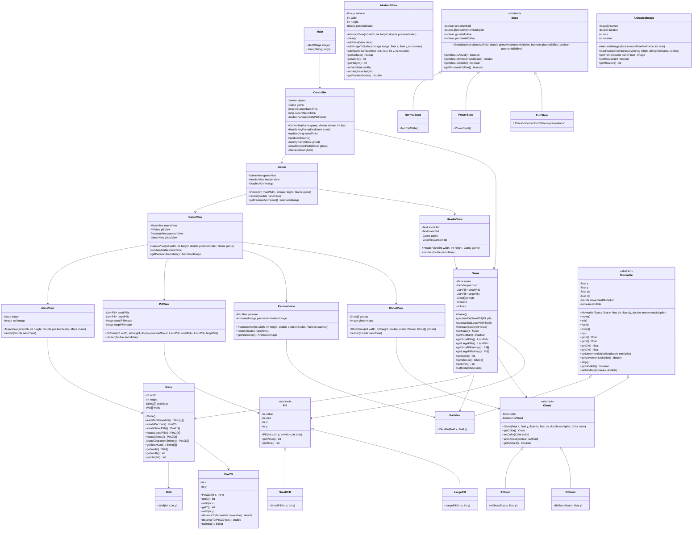

```mermaid
classDiagram
    class Main {
        +start(Stage stage)
        +main(String[] args)
    }

    class Controller {
        -Viewer viewer
        -Game game
        -long previousNanoTime
        -long currentNanoTime
        -double nanosecondsPerFrame
        +Controller(Game game, Viewer viewer, int fps)
        +handleKeyPress(KeyEvent event)
        +update(long nanoTime)
        -handleCollisions()
        -dummyPath(Ghost ghost)
        -moreRandomPath(Ghost ghost)
        -choice(Ghost ghost)
    }

    class Game {
        -Maze maze
        -PacMan pacman
        -List~Pill~ smallPills
        -List~Pill~ largePills
        -Ghost[] ghosts
        -int score
        -int lives
        +Game()
        +pacmanEatSmallPill(Pill pill)
        +pacmanEatLargePill(Pill pill)
        +increaseScore(int value)
        +getMaze() Maze
        +getPacMan() PacMan
        +getSmallPills() List~Pill~
        +getLargePills() List~Pill~
        +getSmallPillsArray() Pill[]
        +getLargePillsArray() Pill[]
        +getScore() int
        +getGhosts() Ghost[]
        +getLives() int
        +setState(State state)
    }

    class Maze {
        -int width
        -int height
        -String[][] textMaze
        -Wall[] walls
        +Maze()
        -readMazeFromFile() String[][]
        +locatePacman() Pos2D
        +locateSmallPills() Pos2D[]
        +locateLargePills() Pos2D[]
        +locateGhosts() Pos2D[]
        -locateCharacter(String c) Pos2D[]
        +getTextMaze() String[][]
        +getWalls() Wall[]
        +getWidth() int
        +getHeight() int
    }

    class Viewer {
        -GameView gameView
        -HeaderView headerView
        -GraphicsContext gc
        +Viewer(int maxWidth, int maxHeight, Game game)
        +render(double nanoTime)
        +getPacmanAnimation() AnimatedImage
    }

    class AbstractView {
        -Group surface
        -int width
        -int height
        -double positionScaler
        +AbstractView(int width, int height, double positionScaler)
        +clear()
        +addView(View view)
        +addImageToSurface(Image image, float x, float y, int rotation)
        +addTextToSurface(Text text, int x, int y, int rotation)
        +getSurface() Group
        +getWidth() int
        +getHeight() int
        +setWidth(int width)
        +setHeight(int height)
        +getPositionScaler() double
    }

    class GameView {
        -MazeView mazeView
        -PillView pillView
        -PacmanView pacmanView
        -GhostView ghostView
        +GameView(int width, int height, double positionScaler, Game game)
        +render(double nanoTime)
        +getPacmanAnimation() AnimatedImage
    }

    class MazeView {
        -Maze maze
        -Image wallImage
        +MazeView(int width, int height, double positionScaler, Maze maze)
        +render(double nanoTime)
    }

    class PillView {
        -List~Pill~ smallPills
        -List~Pill~ largePills
        -Image smallPillImage
        -Image largePillImage
        +PillView(int width, int height, double positionScaler, List~Pill~ smallPills, List~Pill~ largePills)
        +render(double nanoTime)
    }

    class PacmanView {
        -PacMan pacman
        -AnimatedImage pacmanAnimationImage
        +PacmanView(int width, int height, double positionScaler, PacMan pacman)
        +render(double nanoTime)
        +getAnimation() AnimatedImage
    }

    class GhostView {
        -Ghost[] ghosts
        -Image ghostImage
        +GhostView(int width, int height, double positionScaler, Ghost[] ghosts)
        +render(double nanoTime)
    }

    class HeaderView {
        -Text scoreText
        -Text livesText
        -Game game
        -GraphicsContext gc
        +HeaderView(int width, int height, Game game)
        +render(double nanoTime)
    }

    class State {
        <<abstract>>
        -boolean ghostIsAfraid
        -double ghostMovementMultiplier
        -boolean ghostIsEdible
        -boolean pacmanIsEdible
        +State(boolean ghostIsAfraid, double ghostMovementMultiplier, boolean ghostIsEdible, boolean pacmanIsEdible)
        +getGhostIsAfraid() boolean
        +getGhostMovementMultiplier() double
        +getGhostIsEdible() boolean
        +getPacmanIsEdible() boolean
    }

    class NormalState {
        +NormalState()
    }

    class PowerState {
        +PowerState()
    }

    class EndState {
        // Placeholder for EndState implementation
    }

    class Moveable {
        <<abstract>>
        -float x
        -float y
        -float dx
        -float dy
        -double movementMultiplier
        -boolean isEdible
        +Moveable(float x, float y, float dx, float dy, double movementMultiplier)
        +move()
        +left()
        +right()
        +down()
        +up()
        +getX() float
        +getY() float
        +getDX() float
        +getDY() float
        +setMovementMultiplier(double multiplier)
        +getMovementMultiplier() double
        +stop()
        +getIsEdible() boolean
        +setIsEdible(boolean isEdible)
    }

    class PacMan {
        +PacMan(float x, float y)
    }

    class Ghost {
        <<abstract>>
        -Color color
        -boolean isAfraid
        +Ghost(float x, float y, float dx, float dy, double multiplier, Color color)
        +getColor() Color
        +setColor(Color color)
        +setIsAfraid(boolean isAfraid)
        +getIsAfraid() boolean
    }

    class AGhost {
        +AGhost(float x, float y)
    }

    class BGhost {
        +BGhost(float x, float y)
    }

    class Pos2D {
        -int x
        -int y
        +Pos2D(int x, int y)
        +getX() int
        +setX(int x)
        +getY() int
        +setY(int y)
        +distanceTo(Moveable moveable) double
        +distanceTo(Pos2D pos) double
        +toString() String
    }

    class Pill {
        <<abstract>>
        -int value
        -int size
        -int x
        -int y
        +Pill(int x, int y, int value, int size)
        +getValue() int
        +getSize() int
    }

    class SmallPill {
        +SmallPill(int x, int y)
    }

    class LargePill {
        +LargePill(int x, int y)
    }

    class Wall {
        +Wall(int x, int y)
    }

    class AnimatedImage {
        -Image[] frames
        -double duration
        -int size
        -int rotation
        +AnimatedImage(double nanoTimePerFrame, int size)
        +loadFramesFromDirectory(String folder, String fileName, int files)
        +getFrame(double nanoTime) Image
        +setRotation(int rotation)
        +getRotation() int
    }

    Main --> Controller
    Controller --> Viewer
    Controller --> Game
    Viewer --> GameView
    Viewer --> HeaderView
    GameView --> MazeView
    GameView --> PillView
    GameView --> PacmanView
    GameView --> GhostView
    MazeView --> Maze
    PillView --> Pill
    PacmanView --> PacMan
    GhostView --> Ghost
    HeaderView --> Game
    Game --> Maze
    Game --> PacMan
    Game --> Ghost
    Game --> Pill
    Maze --> Wall
    Maze --> Pos2D
    Ghost <|-- AGhost
    Ghost <|-- BGhost
    Moveable <|-- PacMan
    Moveable <|-- Ghost
    Pill <|-- SmallPill
    Pill <|-- LargePill
    State <|-- NormalState
    State <|-- PowerState
    State <|-- EndState
```